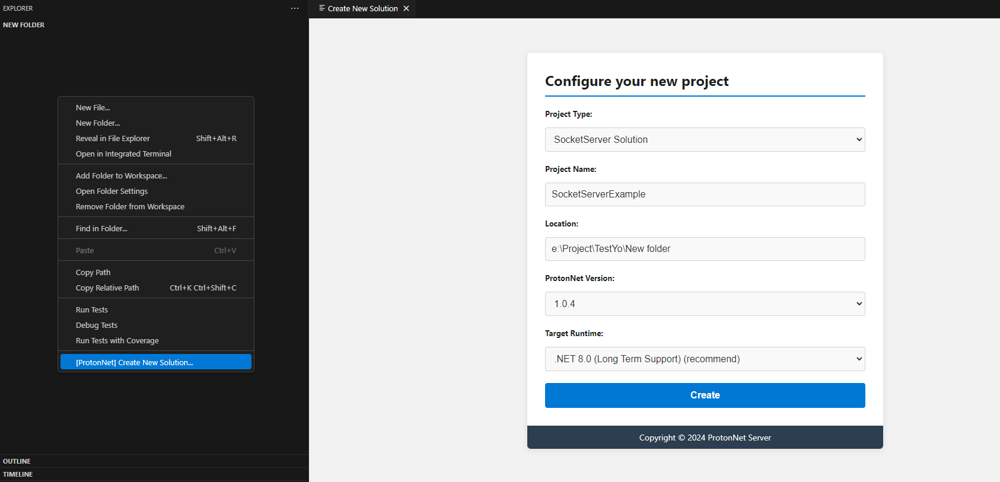
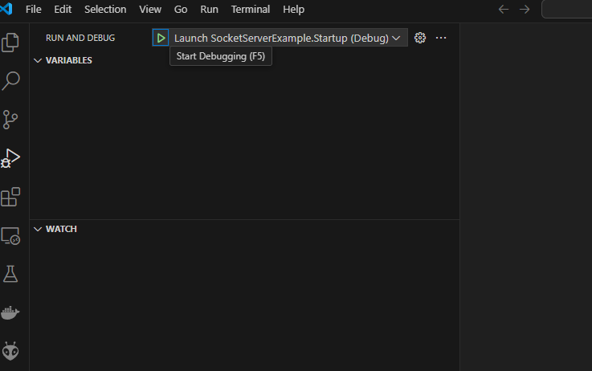
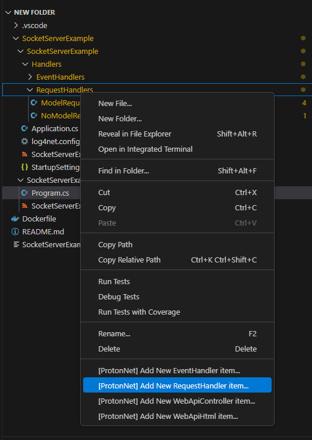

  [](https://star-history.com/#XmobiTea-Family/ProtonNetSolution)

## I. Introduction

`Proton Net Server` is a comprehensive solution for building multiplayer server systems based on the `.NET` platform and the `C#` programming language. This solution works seamlessly with `Unity` and supports deployment across multiple platforms.

## II. Supported IDEs

- **Visual Studio Code**
- **Visual Studio** (Windows only)

## III. Key Features

- **Easy to Learn**: Built with `C#`, a popular and accessible language.
- **Cross-Platform Deployment**: Supports `Windows`, `Linux`, and `macOS`.
- **Diverse Protocols**: Integrated support for `TCP`, `UDP`, `WebSocket`, and `SSL/TLS`.
- **Unity Compatibility**: Supports Unity platforms like `Android`, `iOS`, `WebGL`, and more.
- **WebAPI and Socket Integration**: Choose between `WebAPI` and `Socket` depending on your needs.
- **Easy Debugging**: Support for `breakpoints` and a powerful debugging experience.
- **Data Compression and Encryption**: Uses `MessagePack` for `RpcProtocol`, which reduces bandwidth and supports data encryption.
- **Flexible Request Handling**: Handle requests using `OperationRequest`, `OperationResponse`, and `OperationEvent`, depending on your specific requirements.

## IV. Quick Start

### 1. Setting Up the Server

#### Installing ProtonNet Template for Visual Studio Code

- Download and install `ProtonNet Template for Visual Studio Code` from [ProtonNet.Solution.VisualStudioCodeTemplate](https://github.com/XmobiTea-Family/ProtonNet.Solution.VisualStudioCodeTemplate).
- If you are using `Visual Studio` on Windows, see the guide here: [ProtonNet.Solution.VisualStudioTemplate](https://github.com/XmobiTea-Family/ProtonNet.Solution.VisualStudioTemplate).

#### Creating a Server Project

- Open Visual Studio Code and choose the appropriate ProtonNet project type:
  - **WebApiServer**: For Web or API-based projects.
  - **SocketServer**: For projects using Socket.

For example, let’s create a project called `SocketServerExample` with ProtonNet version `1.0.4` and targeting `.NET 8.0`:



Once created, you can run the project by selecting `Launch SocketServerExample.Startup (Debug)` in Visual Studio Code:



#### Adding a New Handler

Suppose you want to add a login command. Navigate to the `Handlers/RequestHandlers` folder and add the file `LoginRequestHandler.cs`:



Edit the content of `LoginRequestHandler.cs` as follows:

```csharp
class LoginRequestModel
{
    [StringDataMember(Code = "username", MinLength = 6, MaxLength = 20)]
    public string Username;

    [StringDataMember(Code = "password", MinLength = 6, MaxLength = 20)]
    public string Password;
}

[AllowAnonymous]
class LoginRequestHandler : RequestHandler<LoginRequestModel>
{
    public override string GetOperationCode() => "login";

    private IDictionary<string, string> userRepo { get; }

    public override async Task<OperationResponse> Handle(LoginRequestModel requestModel, OperationRequest operationRequest, SendParameters sendParameters, IUserPeer userPeer, ISession session)
    {
        this.logger.Info("Received request: " + requestModel.Username + " " + requestModel.Password);

        if (this.userRepo.TryGetValue(requestModel.Username, out var password))
        {
            if (password == requestModel.Password)
            {
                return new OperationResponse(operationRequest.OperationCode)
                {
                    DebugMessage = "Login success",
                    ReturnCode = ReturnCode.Ok
                };
            }
        }

        return new OperationResponse(operationRequest.OperationCode)
        {
            DebugMessage = "Invalid username or password",
            ReturnCode = ReturnCode.OperationInvalid
        };
    }

    public LoginRequestHandler()
    {
        this.userRepo = new Dictionary<string, string>
        {
            ["admin"] = "123456"
        };
    }
}
```

Run the project again and test it.

### 2. Unity Client

#### Download and Import Unity Package

- Download the `Unity Client Sdk` from here: [ProtonNet.Solution.UnityClientSdk](https://github.com/XmobiTea-Family/ProtonNet.Solution.UnityClientSdk).

#### Create a MonoBehaviour Script

Create a new `MonoBehaviour` script in Unity with the following content:

```csharp
public class ProtonNetworkBehaviour : MonoBehaviour {
    IClientPeerFactory clientPeerFactory;
    ISocketClientPeer socketClientPeer;

    void Start()
    {
        LogManager.SetLoggerFactory(UnityLoggerFactory.Instance);

        clientPeerFactory = UnityClientPeerFactory.NewBuilder()
            .SetAutoCallService(true)
            .Build();

        socketClientPeer = clientPeerFactory.NewSocketClientPeer("http://127.0.0.1:32202", XmobiTea.ProtonNet.Client.Socket.Types.TransportProtocol.Tcp);
        socketClientPeer.Connect(true, (connectionId, serverSessionId) =>
        {
            Debug.Log("OnConnected");
            Debug.LogError(connectionId + " " + serverSessionId);
        }, (reason, message) =>
        {
            Debug.Log("OnDisconnected");
            Debug.LogError(reason + " " + message);
        });
    }

    void Update()
    {
        if (Input.GetKeyDown(KeyCode.Space))
        {
            socketClientPeer.Send(new OperationRequest()
                .SetOperationCode("login")
                .SetParameters(GNHashtable.NewBuilder()
                    .Add("username", "admin")
                    .Add("password", "123456")
                    .Build()), response =>
                {
                    Debug.Log("Received from Server: " + response.ReturnCode + ", DebugMessage: " + response.DebugMessage);
                }, new SendParameters()
                {
                    Encrypted = false,
                });
        }
    }
}
```

- Attach this script to a `GameObject` in Unity and run the project. When you see the `OnConnected` log, press `Space` to send the login request.

## V. Additional Information

* Besides using `OperationRequest` (which requires the server to process and return an `OperationResponse`), you can also use `OperationEvent` (which does not require any response).
* Feel free to add more `EventHandler` or `RequestHandler` depending on the needs of your project.

## VI. Documentation and Examples

[ProtonNet Documentation](https://docs.protonnetserver.com)

For more detailed examples, check out [ProtonNet Examples](https://github.com/XmobiTea-Family/ProtonNet.Solution.Examples).

## VII. Deploy production

Use [ProtonNet Control](https://github.com/XmobiTea-Family/ProtonNet.Solution.Control) to deploy your solution for production.

## VIII. Need Help?

- If you encounter any issues, feel free to share them on [ProtonNet Discussions](https://discussions.protonnetserver.com) or contact me via email at changx.develop@gmail.com.

**Enjoy your development with ProtonNet!**
